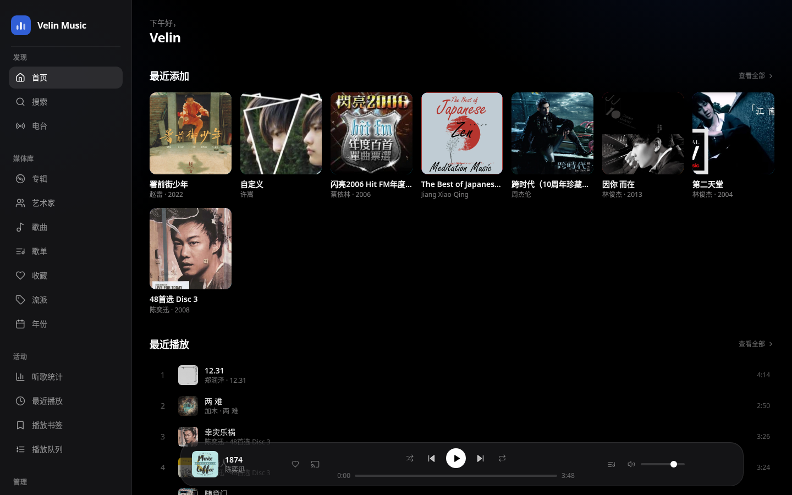
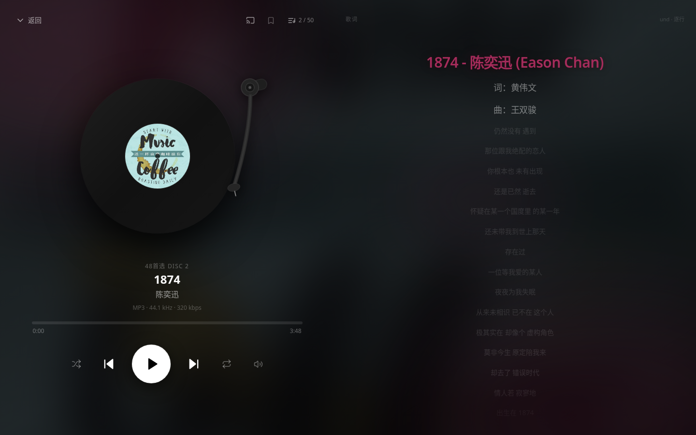
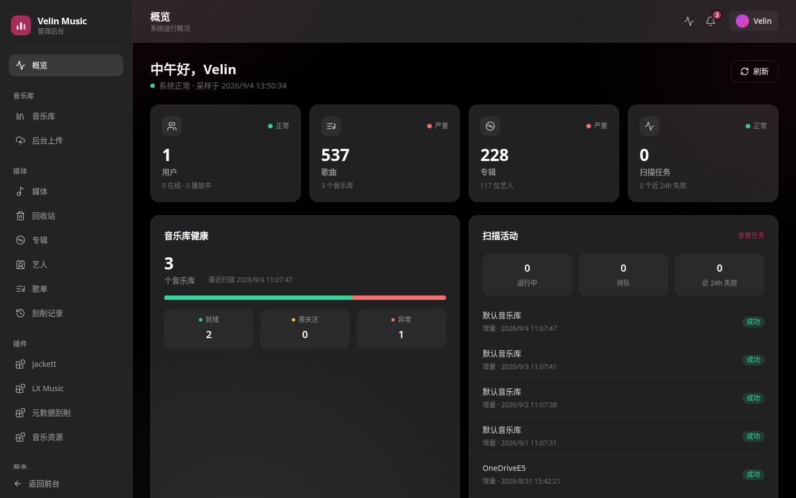

# Velin Music 0.1.26

<p align="center">
  <strong>自托管音乐库、播放器与媒体服务</strong><br>
  在自己的服务器上整理、搜索、播放和管理音乐，数据始终留在自己的存储中。
</p>

<p align="center">
  <a href="https://github.com/ttyob/velin-music/releases/latest">最新版本</a> ·
  <a href="https://github.com/ttyob/velin-music/pkgs/container/velin-music">GHCR 镜像</a> ·
  <a href="https://github.com/ttyob/velin-music/releases">发布包</a>
</p>

## 项目简介

Velin Music 是面向个人、家庭和小型团队的自托管音乐服务。它以现有音乐文件为中心建立索引，提供
Web 播放器、歌词与封面、收藏和播放列表，并通过管理后台完成曲库扫描、任务、插件和系统设置。
原始音频不会因为刮削或整理而被移动或改名。

公开仓库是由私有源码仓库导出的可运行 backend 构建版本，包含 PHP 应用、数据库迁移、前端静态文件和
已在 Alpine 中验证的 `linux/amd64` Helper；不包含私有源码、用户数据、媒体文件或凭据。公开插件包单独
发布到 [Velin Music 插件库](https://github.com/ttyob/velin-music-plugins)，不附在 backend Release 中。

## 功能

- **音乐库**：扫描本地曲库，按歌曲、专辑、艺人、流派和年份浏览，支持全文搜索。
- **播放体验**：队列、最近播放、收藏、播放列表、随机推荐、播放进度恢复和响应式 Web 播放器。
- **媒体处理**：FFmpeg/FFprobe 转码，歌词显示与时间轴，封面和描述元数据刮削，独立可重建的缓存。
- **管理后台**：媒体库配置、增量扫描、上传、重复项检查、回收站、任务历史、用户和隐私设置。
- **家庭设备**：通过 DLNA 和 OwnTone/AirPlay 将音乐投放到局域网设备；WebDAV 曲库支持按需读取。
- **插件扩展**：公开版本包含元数据刮削、LX Music 和 Jackett 插件，可在后台查看运行状态。
- **安全与可靠性**：Session/CSRF/对象授权、SQLite WAL 与迁移、Redis 队列、不可变镜像摘要和校验清单。

## 预览

固定深色界面适配桌面和移动浏览器，以下截图来自实际 Web 客户端。页面内容会根据账户权限和媒体数据展示。

<p align="center">
  
  
  
</p>

<p align="center"><sub>Web 首页 · 正在播放 · 管理后台</sub></p>

## 架构

```text
浏览器 / App
     │
     ▼
Go Media Gateway :8787
     ├── /api/*、认证和写操作 ─────► Webman/PHP :18787 (容器内回环)
     └── 图片、JS、CSS、字体、原始媒体 ─► 直接读取并发送
                                      │
                         SQLite + Redis + /storage
```

Go 网关只负责高并发的静态和媒体读取；Webman 负责认证、授权、数据库事务、任务编排和审计。因此图片、
字体或脚本请求不会占用等待 API 数据的 PHP Worker。

## 安装

### 环境要求

- Linux 主机，Docker Engine 24+ 和 Docker Compose v2
- `linux/amd64`（当前公开镜像只发布此架构）
- 至少一个用于保存音乐的磁盘目录；生产环境建议使用 SSD 保存 `docker-data`

### 使用 Release 部署包（推荐）

部署包已经固定 backend 镜像的 SHA-256 digest，并带有 Compose、初始化脚本和校验清单。不要直接把本仓库
当作生产 Compose 的构建上下文。

```bash
VERSION=0.1.26
curl -fL -o "velin-music-deploy-${VERSION}.tar.gz" \
  "https://github.com/ttyob/velin-music/releases/download/v${VERSION}/velin-music-deploy-${VERSION}.tar.gz"
tar -xzf "velin-music-deploy-${VERSION}.tar.gz"
cd "velin-music-deploy-${VERSION}"

# 可选但推荐：确认部署包未被篡改
sha256sum -c CONTENTS.sha256

cp .env.docker.example .env
docker compose pull
docker compose up -d --wait
docker compose ps
```

浏览器打开 `http://服务器地址:8787`，按首次启动页面创建管理员账户。首次启动会自动生成认证密钥、凭据
密钥和指标令牌；有效配置不会在重启时轮换。将 `VELIN_PUBLIC_URL` 设置为实际 HTTPS 地址后，系统会启用
安全 Cookie。

### 目录布局

| 宿主机目录 | 容器路径 | 用途 |
| --- | --- | --- |
| `docker-data/` | `/data` | SQLite、配置、运行时文件、插件和刮削缓存 |
| `docker-data/cache/scrape/` | `/data/cache/scrape` | 可重建的歌词、封面和刮削结果 |
| `storage/music/` | `/storage/music` | 音乐库原始文件 |
| `storage/downloads/` | `/storage/downloads` | 插件下载的临时或待整理文件 |

音乐库和缓存是两套独立根目录。请确保 Docker 进程对这两个宿主目录有正确的读写权限，不要把数据库、
密钥或整个宿主机根目录挂载进容器。

## 日常操作

```bash
# 查看服务状态和日志
docker compose ps
docker compose logs -f --tail=200 backend

# 升级到新的 Release：替换为新部署包后执行
docker compose pull
docker compose up -d --wait

# 停止服务（保留数据）
docker compose stop
```

升级前请保留 `docker-data/database/` 的备份。不要执行 `docker compose down -v`，否则会删除 Redis 持久化
卷。部署包中的自动升级流程会在迁移前创建 SQLite 冷备份，健康检查失败时恢复旧环境。

## 插件

| 插件 | 用途 |
| --- | --- |
| `metadata-scrape` | 获取歌曲、专辑和艺人的描述元数据、歌词与封面 |
| `lx-music` | 对接 LX Music 脚本 Runner，搜索和补充音乐资源 |
| `jackett` | 对接 Jackett 索引器，管理搜索订阅和下载任务 |

管理员可以在后台的资源插件页面查看版本、启停插件和检查健康状态。插件归档只在首次初始化时安装到
`docker-data/plugins`，不会覆盖已经存在的配置。私有或商业插件不包含在公开 Release 中。

## 发布文件

每个稳定 `vX.Y.Z` Release 通常包含：

- `velin-music-deploy-X.Y.Z.tar.gz`：只含运行配置的 Docker Compose 部署包
- `SHA256SUMS` 与部署包内的 `CONTENTS.sha256`：文件完整性校验
- GHCR 中的 `linux/amd64` 镜像、SBOM、构建证明和签名

公开插件归档和 `index.json` 位于独立的 [Velin Music 插件库](https://github.com/ttyob/velin-music-plugins)，
backend Release 不重复附带插件 ZIP。

镜像标签用于阅读和发现版本，生产环境应优先使用部署包写入的 digest。发布流程不会覆盖已经存在的版本标签。

## 限制与安全提示

- 当前不提供 arm64 镜像；不要在 ARM 主机上强行拉取 amd64 镜像作为生产方案。
- 服务默认绑定宿主机 `8787`，请在反向代理或防火墙中限制管理入口，并为公网访问配置 HTTPS。
- 媒体文件、SQLite 数据库、日志和密钥不属于公开仓库内容；请把备份存放在受控位置。
- 自动刮削只写入数据库或配置的派生缓存；替换已有相邻封面、歌词和音频标签需要单独的管理操作。

## 许可证

公开 backend 的许可证和第三方组件声明见仓库中的 [`LICENSE`](LICENSE) 与 `licenses/`。各插件可能有独立的
许可证和服务条款，使用前请查看对应插件说明。
